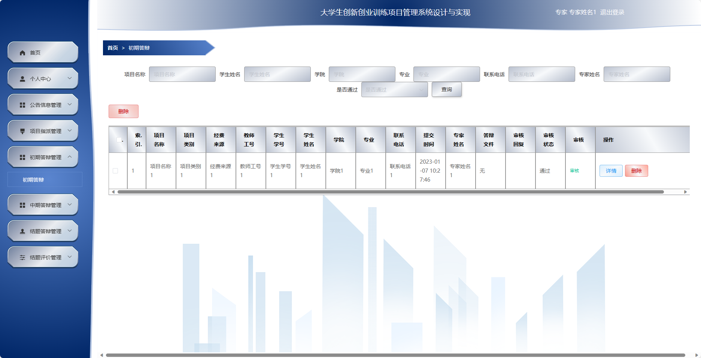
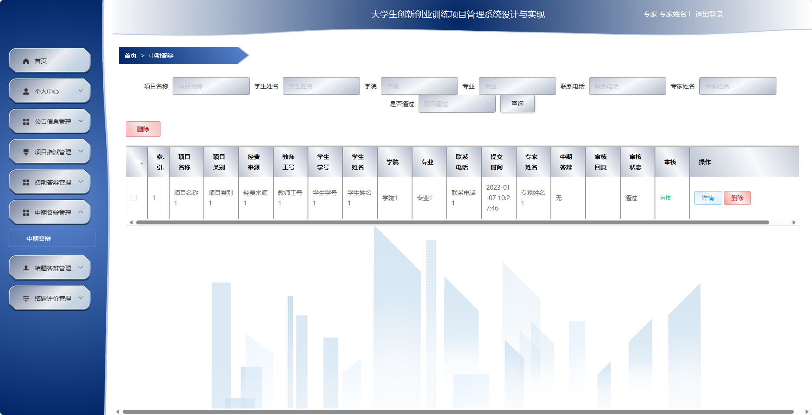
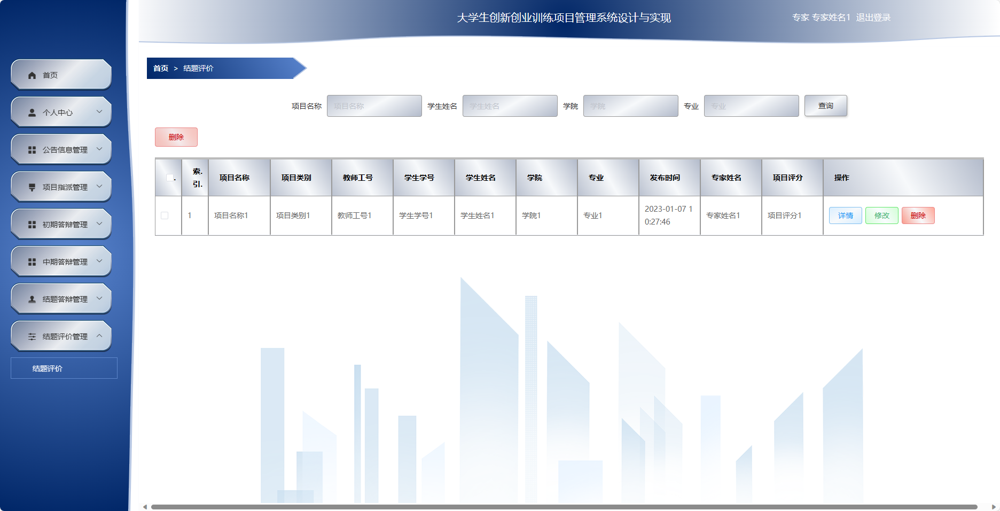
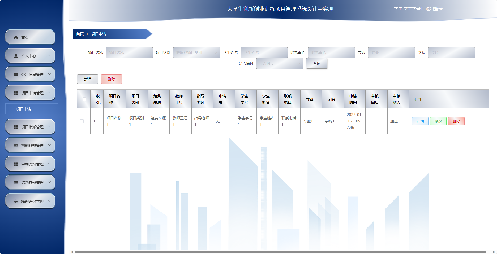
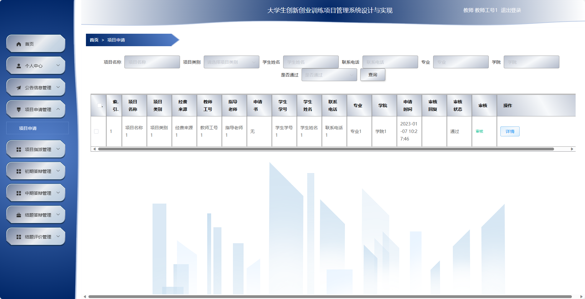
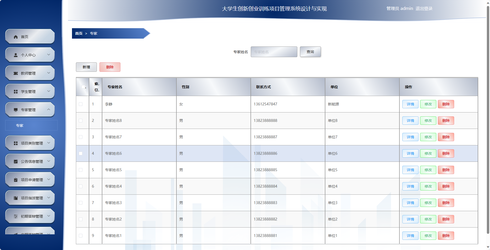
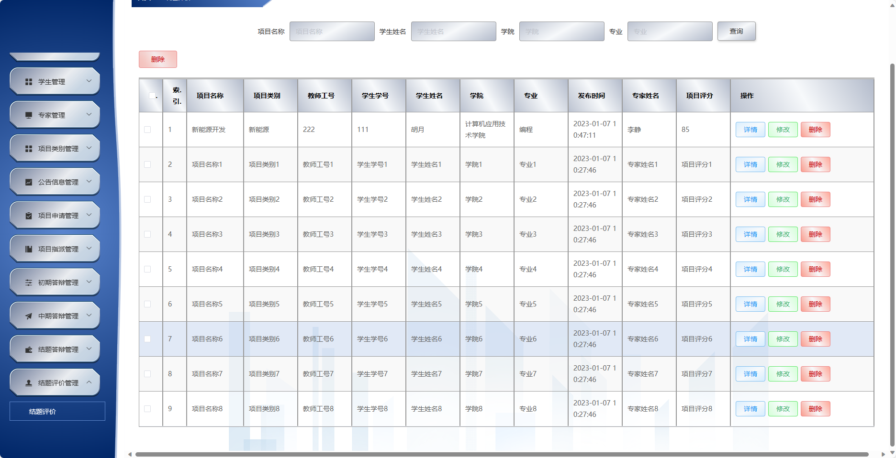
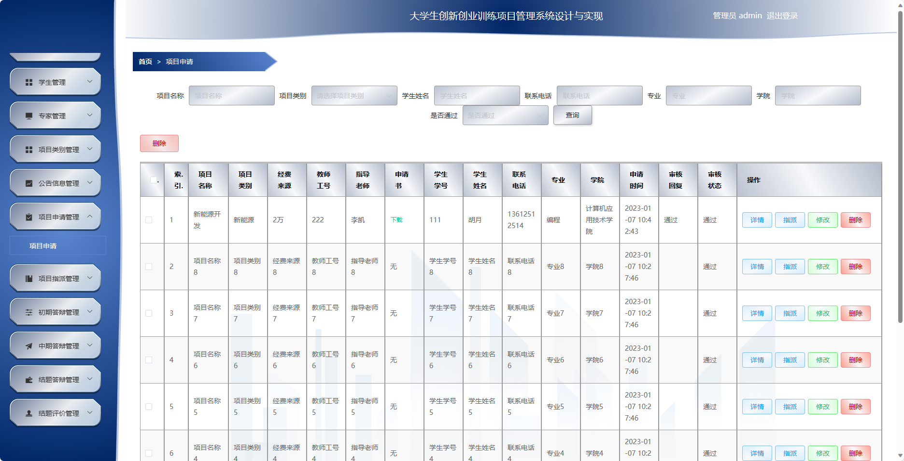
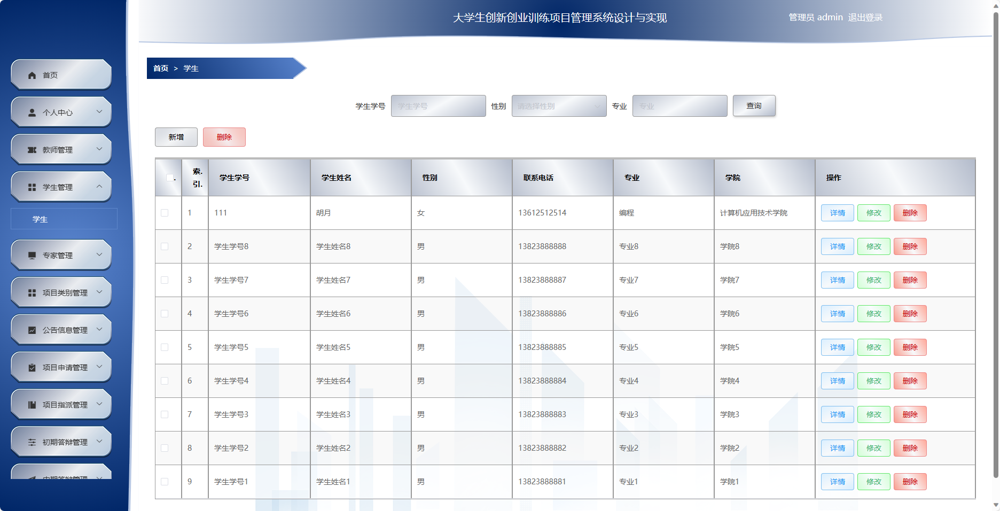

基于SpringBoot的大学生创新创业训练项目管理系统
=
- 完整代码获取地址：从戎源码网 ([https://armycodes.com/](https://armycodes.com/))
- 作者微信：19941326836  QQ：952045282 
- 承接计算机毕业设计、Java毕业设计、Python毕业设计、深度学习、机器学习
- 选题+开题报告+任务书+程序定制+安装调试+论文+答辩ppt 一条龙服务
- 所有选题地址https://github.com/nature924/allProject

一、项目介绍
---
基于Spring Boot框架实现的大学生创新创业训练项目管理系统，系统包含四种角色：管理员、教师、学生、用户,系统分为前台和后台两大模块，主要功能如下。

### 管理员：
- 个人中心：管理个人信息和账户。
- 教师管理：管理系统中的教师信息。
- 学生管理：管理系统中的学生信息。
- 专家管理：管理系统中的专家信息。
- 项目类别管理：管理系统中的项目类别信息。
- 公告信息管理：发布和管理系统中的公告信息。
- 项目申请管理：查看和管理所有的创新创业项目申请信息。
- 项目指派管理：对创新创业项目进行指派和调配。
- 初期答辩管理：查看和管理所有创新创业项目的初期答辩情况。
- 中期答辩管理：查看和管理所有创新创业项目的中期答辩情况。
- 结题答辩管理：查看和管理所有创新创业项目的结题答辩情况。
- 结题评价管理：对创新创业项目进行结题评价。
- 系统管理：修改个人密码和其他系统设置。

### 教师：
- 个人中心：管理个人信息和账户。
- 公告信息管理：查看系统发布的公告信息。
- 项目申请管理：提交创新创业项目的申请。
- 项目指派管理：管理被分配到的创新创业项目信息。
- 初期答辩管理：管理所指导的创新创业项目的初期答辩情况。
- 中期答辩管理：管理所指导的创新创业项目的中期答辩情况。
- 结题答辩管理：管理所指导的创新创业项目的结题答辩情况。
- 结题评价管理：对所指导的创新创业项目进行结题评价。
- 系统管理：修改个人密码和其他系统设置。

### 学生：
- 个人中心：管理个人信息和账户。
- 公告信息管理：查看系统发布的公告信息。
- 项目申请管理：提交创新创业项目的申请。
- 项目指派管理：管理被分配到的创新创业项目信息。
- 初期答辩管理：管理参与的创新创业项目的初期答辩情况。
- 中期答辩管理：管理参与的创新创业项目的中期答辩情况。
- 结题答辩管理：管理参与的创新创业项目的结题答辩情况。
- 结题评价管理：对参与的创新创业项目进行结题评价。
- 系统管理：修改个人密码和其他系统设置。

### 专家：
- 个人中心：管理个人信息和账户。
- 公告信息管理：查看系统发布的公告信息。
- 项目指派管理：被分配到的创新创业项目信息。
- 初期答辩管理：管理所评审的创新创业项目的初期答辩情况。
- 中期答辩管理：管理所评审的创新创业项目的中期答辩情况。
- 结题答辩管理：管理所评审的创新创业项目的结题答辩情况。
- 结题评价管理：对所评审的创新创业项目进行结题评价。
- 系统管理：修改个人密码和其他系统设置。

二、项目技术
---
- 编程语言：Java
- 数据库：MySQL
- 项目管理工具：Maven
- 前端技术：VUE、HTML、Jquery、Bootstrap
- 后端技术：Spring、SpringMVC、MyBatis

三、运行环境
---
- 操作系统：Windows、macOS都可以
- JDK版本：JDK1.8以上都可以
- 开发工具：IDEA、Ecplise、Myecplise都可以
- 数据库: MySQL5.7以上都可以
- Tomcat：任意版本都可以
- Maven：任意版本都可以

四、运行截图
---
### 论文截图：

### 程序截图：

